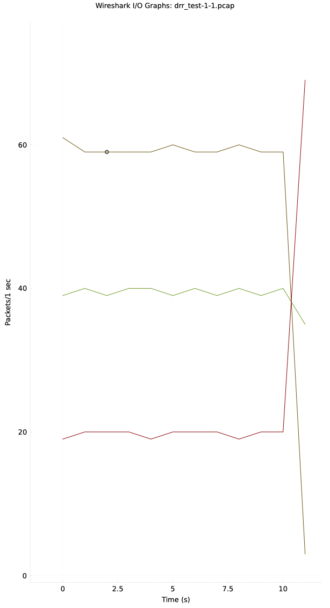

# A Base Class to Simulate Differentiated Services

## Developers

* Deep Mistry
* Gizem Hazal Senturk

## Table of Contents

* [Introduction](#introduction)
* [Installation](#installation)
  * [Dependencies](#dependencies)
  * [Installation](#installation)
* [Run](#run)
* [Evaluation](#evaluation)

## Introduction

This project is a simulation of a network with differentiated services by using different QoS algorithms. Strict Priority Queueing(SPQ)
and Deficit Round Robin(DRR) is implemented in the context of this project. Programs get the configurations for the traffic from the user
(network admin) and loads on the router node the format of the file is XML. The simulation is done using the [ns-3](https://www.nsnam.org/)
network simulator. The traffic at the end of the simulation is saved in a pcap files. 

## Installation

### Dependencies

* [ns-3](https://www.nsnam.org/) (version 3.38)
* RapidXML (version 1.13)

* ns-3 prerequisites (Table content is retrieved from [ns-3](https://www.nsnam.org/docs/release/3.38/tutorial/singlehtml/index.html) website)
* | Prerequisite | Package/Version                                                                |
  | ------------ | ------------------------------------------------------------------------------ |
  | C++ compiler | clang++ or g++ (g++ version 9 or greater)                                      |
  | Python       | python3 version >=3.6                                                          |
  | CMake        | `cmake` version >=3.10                                                         |
  | Build system | make, ninja, xcodebuild (XCode)                                                |
  | Git          | any recent version (to access _ns-3_ from [**GitLab.com**](http://GitLab.com)) |
  | tar          | any recent version (to unpack an ns-3 release)                                 |
  | bunzip       | any recent version (to uncompress an ns-3 release)                             |

  
### Installation

* Install ns-3

## Run

Important: All the source code should be carried out in the ns-3.38/scratch/ directory. The hierarchy for the parser directory should be protected. 
RapidXML files should be in the parser folder within the source code. 

* Run the simulation with the following command in the ns-3.38/ directory where ns3 executable is located as below:

```bash
./ns3 run "nwp2 --strArg=<filename.xml>"
```

The pcap files will be saved in the ns-3.38/ directory. Naming convention for the pcap files is as follows:

```bash
<algorithm>_<filename>.pcap
```

## Config file

The parameters can be introduces in the config file are the following and it is important to keep the naming convention the same:
Source IP Address:
<source_ip_address> value of source_ip_address </source_ip_address>

Destination IP Address:
<destination_ip_address> value of destination_ip_address </destination_ip_address>

Source Port:
<source_port> value of source_port </source_port>

Destination Port:
<destination_port> value of destination_port </destination_port>

Protocol:
<protocol> value of protocol </protocol>

Source Mask:
<source_mask> value of source_mask </source_mask>
Destination Mask:
<destination_mask> value of destination_mask </destination_mask>

 | Param            | Config                 | Examples      |
 |------------------|------------------------|---------------|
 | Source Ip        | source_ip_address      | 1.0.9.3       |
 | Destination Ip   | destination_ip_address | 1.0.9.3       |
 | Source Port      | source_port            | 8080          |
 | Destination Port | destination_port       | 8080          |
 | Protocol         | protocol               | 17            |
 | Source Mask      | source_mask            | 255.255.255.0 |
 | Destination Mask | destination_mask       | 255.255.255.0 |
 | Default Queue    | is_default             | true,false    |


### Sample config file
An example of config file is as below:

```
<queues>
  <queue>
    <name>Queue1</name>
    <priority>3</priority>
    <is_default>true</is_default>
    <filters>
      <filter_elements>
        <destination_port>2</destination_port>
      </filter_elements>
      <filter_elements>
        <source_ip_address>1.0.9.3</source_ip_address>
        <source_port>8080</source_port>
      </filter_elements>
      <filter_elements>
        <source_ip_address>1.0.19.3</source_ip_address>
        <source_port>8080</source_port>
      </filter_elements>
    </filters>
  </queue>
  <queue>
    <name>Queue2</name>
    <priority>2</priority>
    <filters>
      <filter_elements>
        <destination_port>1</destination_port>
      </filter_elements>
      <filter_elements>
        <source_ip_address>1.0.9.55</source_ip_address>
        <source_port>8080</source_port>
      </filter_elements>
    </filters>
  </queue>
</queues>
...
```
## Evaluation

In order to evaluate the results, we have used the [Wireshark](https://www.wireshark.org/) tool. The pcap files can be opened with Wireshark and the results can be analyzed.

The example graphs as below can be obtained from the pcap files using Wireshark through Statistics -> I/O Graphs.


